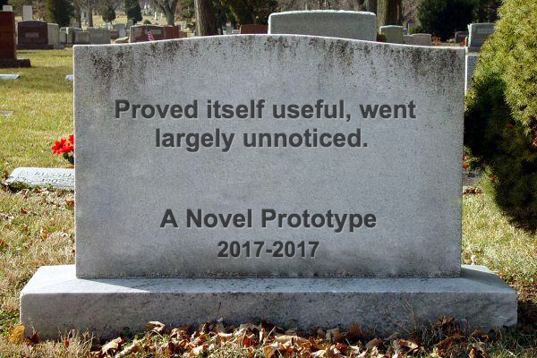

---
---
<!-- markdownlint-disable MD041-->
<!-- markdownlint-disable MD033-->
<!-- markdownlint-disable MD026-->

# Security Startup Test Drive -program

*Security Startup Test Drive is a risk-free way to see if you
would enjoy a life of a security startup hacker.*

## Designed for You

We didn't design this to test you. We did it for you. You can test
a life as a hip security startup hacker! If you like it, you get to keep
your startup. (Yes, it is yours!)
{: style="page-break-after: always;"}

## Why are we Doing This

{: #w400r}

We've seen so many talented techies, and so many novel ideas and
prototypes... if we only could convince people to be slightly more
megalomanic! If they only realized what is the potential within them!
How great ideas and prototypes would mature, move out and help human kind
to go further in the use of technology?

## Why the Test Drive and not the Real Deal

Real deal is certainly an option. We've just found out that there are two
things sometimes blocking people for trying: financial insecurity and fear of
excessive workload. While these fears are based on reality, we think they can
be overblown. Breaking out is hard, but not Stephen Elop -hard. Just as hard
as anything you want to do properly. Time-limited test drive allows people
to give it a spin, and then decide if the entrepreneur-life is for them.

## What's in it for You

You have the opportunity to try out what it is like to be an entrepreneur.
Stephen Elop -had? Or just as hard than anything else you've wante to do
properly in your life? If you like the experiment, you will unlock
additional quests.

You have the opportunity to see your work being adopted in a large scale.
You will be pursuing your vision, not somebody else's. Even if the initial
idea would come from us, it will become yours in no time - you will see.

And not to mention, you will have the opportunity to be compensated way more
than any desk job ever would. It is ok to be greedy, as long as you tie up
your financial success to the good impact you are making in the world.

## What's in it for Us

We want to earn our living and make our mark by improving the status quo in the
information security field. We believe that most scalable way to do that is to
pave way to new startups and individuals who take ownership, and be a small part
of their success.

## Should I...

A life of an entrepreneur might be for you, if you:

* are strangely attracted to tech or have a tech-related hobby,
* have a track record of working hard (school or work) or you are just a natural,
* have done the math and realized how the Finnish tax system creates
  a hard-to-penetrate glass ceiling for income,
* want to control your destiny as much as you can, and
* think that you could be convinced through examples
  that you can influence the world around you, not just
  your immediate proximity.

## Am I Up for it

This is the point of the Test Drive. Try and see it yourself!
Don't make your life decisions based on perceptions. Get evidence!

## How does this work

{: #w400r}
### Idea

First we choose the idea together. You can bring your own
idea, or your background. Understanding your background, we can probably
suggest a goal worth pursuing.

### Cultivate

Then we  cultivate the idea a bit - together of course.
Are we missing something needed to make it happen?
A team member? More detailed plan? Anything necessary
to be comfortable that next three months will be fruitful.

### Standalone

After the talk there are two ways forward. The standalone path and the
adoption path. In standalone path we have chosen an idea which stands on
its own feet and is worthy of an own company. In adoption path we have
chosen an idea which fundamentally supports some of the companies already
set up.

### Adoption
Or you think that the idea fits to the topics of the existing companies,
and you choose to live the startup-life
with them. The companies in our portfolio are small and cherish open
culture and are happy to adopt you for a test-run. You will be a full
member of the team, just like you would be one of them.
{: style="page-break-after: always;"}

## Case Jani Kenttälä

When I was a teenager that I'll never become an entrepreneur.
Two exits later, I am very happy I didn't keep my promise.
While there are a lot of good signs my attitude is not shared
with people planning their future today, I still wonder how many
good ideas are left undone and how many exiting rides are

Years later from my promise, I ended up in a situation where I could
give entrepreneurship a try. Me and my colleagues at University of Oulu
thought we had something to contribute to the world. We had
two options. Spread the word through academic papers, or
through a commercial company. I had just gone a heavyish process of writing my
M.Sc thesis, so I thought I could give the commercial way a try.

That decision to "try" set things in motion.
I ended up places I could have never imagined. And such (positively) peculiar
things happened that I found this quote from Mark Twain to be pretty solid:

*Truth is stranger than fiction, but it is because Fiction is obliged to
stick to possibilities; Truth isn't.*

I ended up helping a number of governments to increase the security of
their citizens. Not because I'm overly smart, or special in any way.
I just ended up to the company of loony Finns with a desire to go a bit further
than helping the local community, and become one of them.

## Case HowNetWorks Oy
{: #white}

HowNetWorks was the first company to run the test drive.
It was a social startup. The founders balanced the lack business plan by
setting a strict deadline for the company. They set a self-destruct to
three months. By that time there would have to be proof that the company
deserves to exists.

During that time, a pro bono service called URI:Teller saw the daylight.
As a result, a popular instant messaging client called Telegram
had fixed a privacy issue found from it's *Secret Chat* feature.
URI:Teller is now used by individuals around the world.

@oherrala and @FIXME learned tons of new networking tricks
during that three months. Encouraged of the experiences, @oherrala joined
SensorFu, a security startup with an actual business plan.
@FIXME is planning to monetize the lessons learned in another company, as well
as helping other Scandinavian ABC companies.

<!-- markdownlint-enable MD041-->
<!-- markdownlint-enable MD033-->
<!-- markdownlint-enable MD026-->
