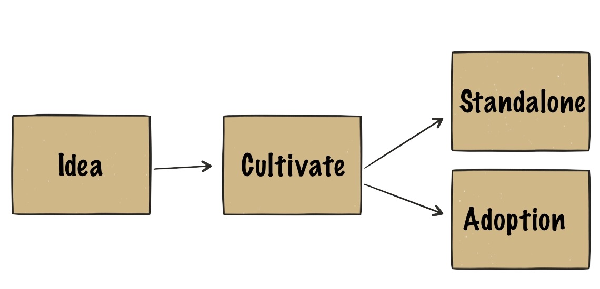

---
---
<!-- markdownlint-disable MD041-->
<!-- markdownlint-disable MD033-->
<!-- markdownlint-disable MD026-->

# Security Startup Test Drive -Program

Security Startup Test Drive is a risk-free way to see if you would enjoy a life
of a security startup entrepreneur. Do you have an idea for improving our online
security? Have you thought of setting up your own company? Do you wonder if
you're up for it? Security Startup Test Drive might be the thing for you!

## Designed for You

We didn't design this to test you. We did it for you. You can test a life as a
hip security startup hacker! If you like it, you get to keep your startup. (Yes,
it is yours!)

{: style="page-break-after: always;"}

## Why are we Doing This

{: #w400r}

We've seen too many bright minds, novel ideas, and prototypes stuck in a
garage-stage. We want to help people with good skills and ideas to break out to
the world. When we improve the status quo in our field, the society can place
more trust on tech, and fly higher, faster. This is our end game.

## What's in it for You

You have the opportunity to try out what it is like to be an entrepreneur. [Elon
Musk](https://en.wikipedia.org/wiki/Elon_Musk) -hard? Or just as hard than
anything else you've wanted to do properly in your life?

## What's in it for Us

We want to earn our living and make our mark by improving the status quo in the
information security field. We believe that most scalable way to do that is to
pave way to new startups and individuals who take ownership. We want to help you
get started and if things turn out to be successful, we share a small part of
the success.

## Who Are We

We at [Scandinavian ABC](http://www.scanabc.com/) are security startup veterans with 1-2
exits behind us. We spent [15 years](https://en.wikipedia.org/wiki/Codenomicon)
popularising new products in new product categories. It went well enough that we are
now able to help you.

You can find us online. [Our main page](http://www.scanabc.com/) has
several social links at the bottom. If you prefer a more personal touch, message
[Jani in LinkedIn](https://www.linkedin.com/in/janikenttala/).

## Why the Test Drive and not the Real Deal

The real deal is certainly an option. We've just found out that two things
sometimes block people for considering the life of an entrepreneur: financial
insecurity and fear of excessive workload. Time-limited test drive allows people
to give it a spin, and then decide what they want to do with their life.

## Should I...

A life of an entrepreneur might be for you, if you:

* are strangely attracted to tech or have a tech-related hobby,
* have a track record of working hard (school or work) or you are just a
  natural,
* want to control your destiny as much as you can,
* think that you could be convinced through examples that you can influence the
  world around you (not just your immediate proximity), or
* have realized how the Finnish tax system creates
  a hard-to-penetrate glass ceiling for income.

## Am I Up for it

This is the point of the Test Drive. Try and see it yourself! Don't make your
life decisions based on perceptions. Get evidence!

## How Does This Work

{: #w400r}

### Idea

First we pick the idea together. You can bring your own idea, or just your
background. Understanding your background, we can probably propose a goal worth
pursuing.

### Cultivate

Then we cultivate the idea a bit - together of course. Is the world ready for
the idea? Are we missing something needed to make it happen? A team member? More
detailed plan? The goal is to make sure the next three months are fun and
fruitful.

### Standalone or Adoption

After we've done talking there are two ways forward. The standalone path and the
adoption path. In standalone path we together have an idea which stands on its
own feet and is worthy of an own company. In the adoption path we have chosen an
idea which fundamentally supports some of the companies already set up. The
companies in our portfolio are small and cherish open culture and are happy to
adopt you for a test-run. You will be a full member of the team, just like you
would be one of them.

{: style="page-break-after: always;"}

## Case Jani Kenttälä

When I was a teenager, I swore that I'll never become an entrepreneur. Two exits
later, I am very happy that I didn't keep my promise. While there are a lot of
good signs that new generation is more adventorous, I still wonder: how many
good ideas are left undone because of misconceptions about entrepreneurship.

Years after I made my promise, I ended up in a situation where I could give
entrepreneurship a spin. Me and my colleagues at the University of Oulu thought
we had something to contribute to the world. We had two options. Spread the word
through academic papers, or through a commercial company. I had just gone a
heavyish process of writing my M.Sc thesis, so I thought I could give the
commercial path a try.

That decision to **try** set things in motion. I ended up places I could have
never imagined. And such (positively) peculiar things happened that I now find
Mark Twain's words solid:

*Truth is stranger than fiction, but it is because Fiction is obliged to stick
to possibilities; Truth isn't.*

I ended up helping a number of governments to improve the online security of
their citizens. Not because I'm overly smart. Not because I'm special in any
way. I just ended up with the company of loony Finns with a desire to go a bit
further than helping the local community, and became one of them.

If you know Finnish, [listen in SoundCloud](https://soundcloud.com/user-400350533/rattoradio-haastattelu-ouspg-open-ja-startup-test-drive)
what Jani has to say about entrepreneurship.

<!-- markdownlint-disable MD022-->

## Case HowNetWorks Oy
{: #white}

<!-- markdownlint-enable MD022-->

HowNetWorks was the first company to run the test drive. The founders balanced
the lack of a surefire business plan by setting a strict deadline for the
company. They set the self-destruct timer to three months. That was the deadline
for delivering the proof that the company deserves to exists.

During those three months a pro bono service called
[URI:Teller](https://uriteller.io/) saw the daylight. It helped to reveal a
privacy issue from a popular instant messaging client called Telegram. Telegram
fixed the issues and URI:Teller is now used by individuals around the world.

HowNetWorks paved the way for another company, called SensorFu. SensorFu is the
other side of the same coin -  while HowNetWorks focuses on [net
neutrality](https://en.wikipedia.org/wiki/Net_neutrality), SensorFu focuses on
sealing the network security policies. Having just aquired relevant new skills
in HowNetWorks, @oherrala co-founded SensorFu to lead their product development.
@jviide bought the shares of HowNetWorks and he will keep it going while working
on setting up a new company.

<!-- markdownlint-enable MD041-->
<!-- markdownlint-enable MD033-->
<!-- markdownlint-enable MD026-->
